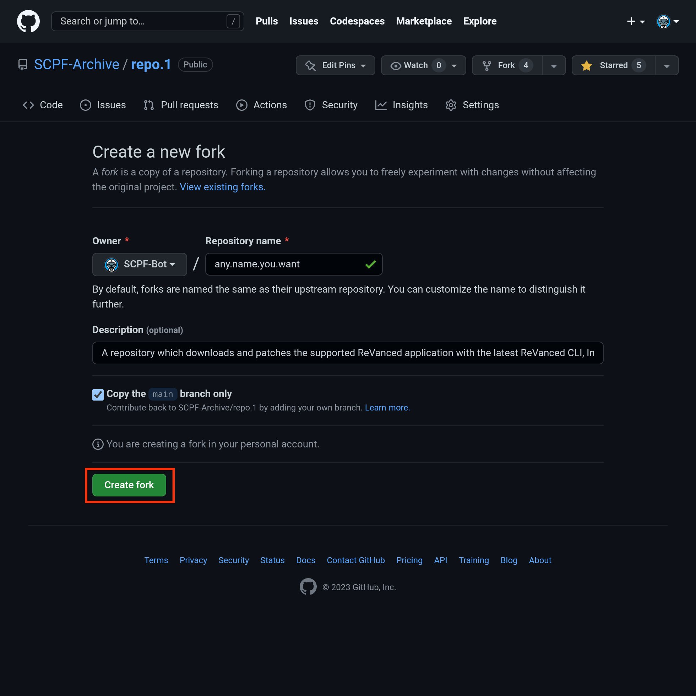
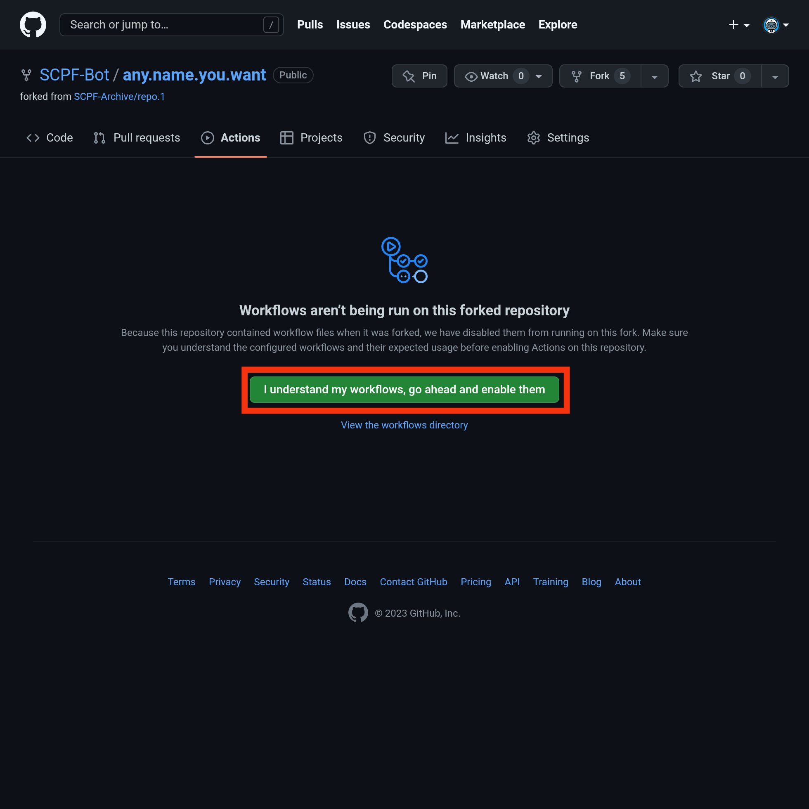
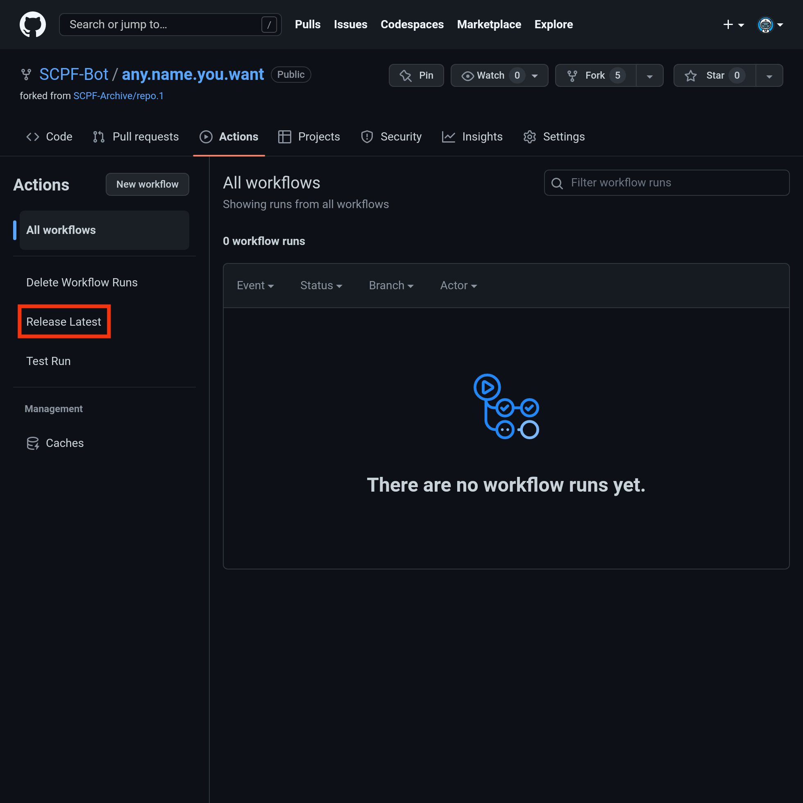
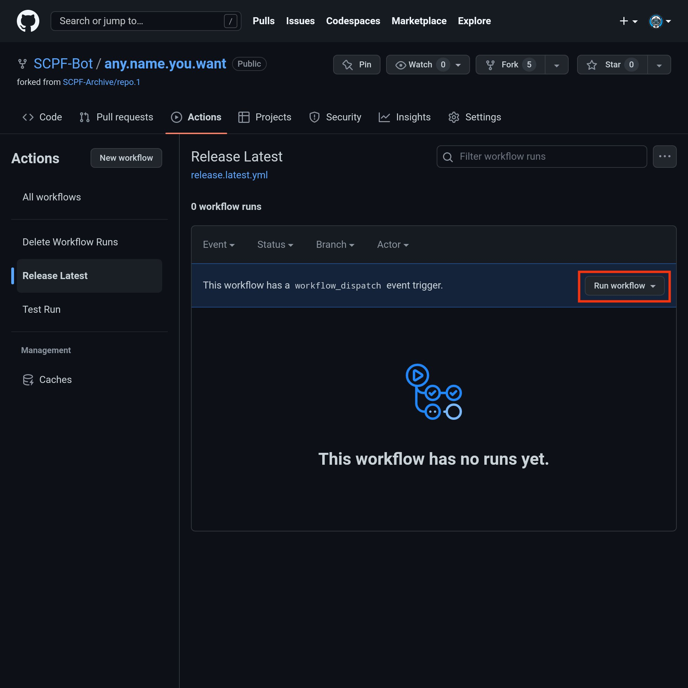
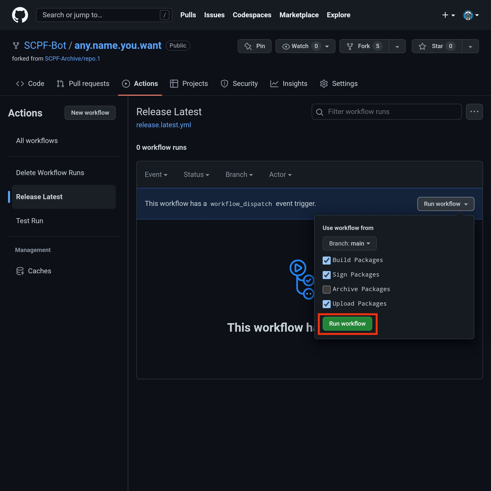
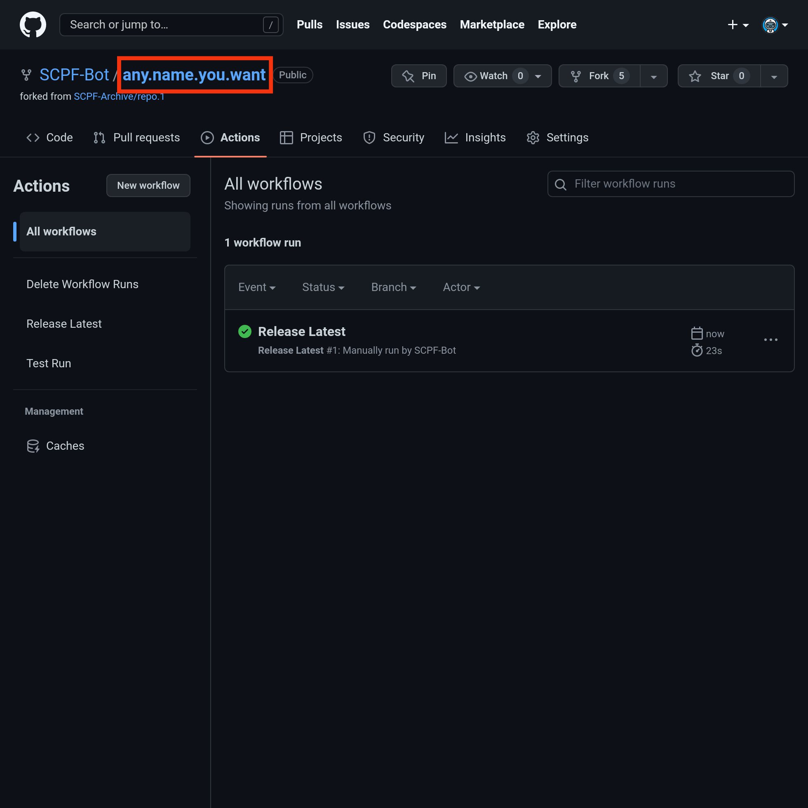
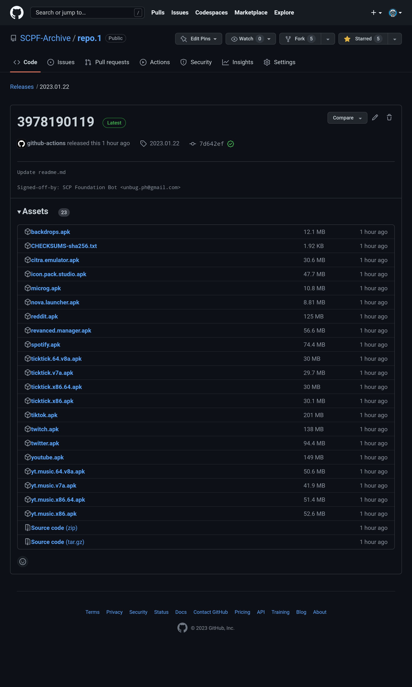
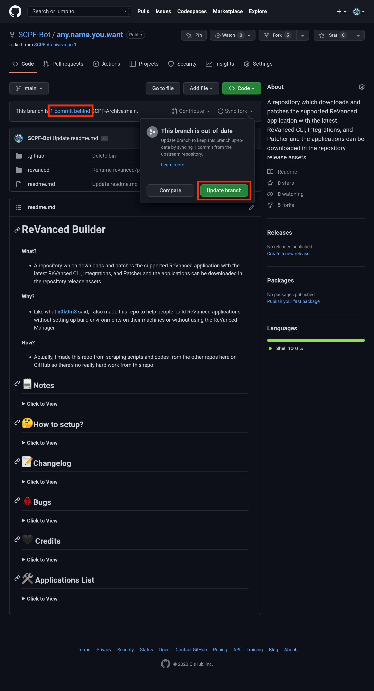

# ReVanced Builder

**What?**
- A repository which downloads and patches the supported ReVanced application with the latest ReVanced CLI, Integrations, and Patcher and the applications can be downloaded in the repository release assets.

**Why?**
- Like what [**n0k0m3**](https://github.com/n0k0m3) said, I also made this repo to help people build ReVanced applications without setting up build environments on their machines or without using the ReVanced Manager.

**How?**
- Actually, I made this repo from scraping scripts and codes from the other repos here on GitHub so there's no really hard work from this repo.

## 🗒️Notes

<b>Click to View</b>

- The script will download the selected versions ([**see here**](/revanced/assets/versions)) of applications on **APK Mirror** and **UpToDown**, **NOT** the latest official version on Google Play.
- The applications are **NON-ROOT** variant so don't expect some **Magisk** modules here.
- Without **microG**, **YouTube** and **YouTube Music** will crash due to missing **microG**, please install **microG**.

## 🤔How to setup?

<b>Click to View</b>

#### Step 0:
You need to have a GitHub account for the following steps.

#### Step 1:
Fork this repository.
- [**How to fork a repository?**](https://docs.github.com/en/get-started/quickstart/fork-a-repo)
- To fork this repository on mobile browser, kindly click [**here**](https://github.com/SCPF-Archive/repo.1/fork).
> **DO NOT FORK** if you need to set the new repo to private, import this repository instead. I recommend to fork this repo instead of importing so you can update your repository whenever there's an update on the main repository.

#### Step 2:
After you forked or imported this repository and made your own repo, go now to your GitHub Actions tab.

#### Step 3:
Click the `I understand my workflows, go ahead and enable them.`.

#### Step 4:
After you enabled the workflows, click the `Release Latest`.

#### Step 5:
Click the `Run workflow`.

#### Step 6:
Click the `Run workflow` button to generate the applications.
> In the checkboxes, you can put a check the `Archive Packages` to release the applications in a compressed .7z archive instead.

 

#### Step 7:
After the workflow is finished (when the indicator is now green colored with check mark), click your repository name above.

#### Step 8:
Download your generated applications in the releases section.

You can visit it by typing this to the the URL:
> `/releases/latest`
>
> `github.com/YourUserName/YourRepoName/releases/latest`
>
> Example:
> `github.com/Ultimatinium/revanced-repo/releases/latest`

Or you can click the `Releases`

> Example:
>
> 

#### Step 9:
After you redirected to the releases section, you can now download your applications.

---

#### Reminder 1:
Don't forget to always check and update these folders :

- [**Patches Folder**](revanced/assets/patches)
- [**Versions Folder**](revanced/assets/versions)

> Those folders are meant to be checked and updated.

#### Reminder 2:
When you see that you are `# commit/s behind`, update your repo by clicking the `Sync fork` -> `Update branch`.

## 📝Changelog

<b>Click to View</b>

- Update Setup Steps ([**#17**](https://github.com/SCPF-Archive/repo.1/pull/17))
- Update Workflow File ([**#16**](https://github.com/SCPF-Archive/repo.1/pull/16))
- Add x86_64 and x86 ([**#14**](https://github.com/SCPF-Archive/repo.1/pull/14))
- Fix Spotify Download ([**#13**](https://github.com/SCPF-Archive/repo.1/pull/13))
- Add Nova Launcher ([**#12**](https://github.com/SCPF-Archive/repo.1/pull/12))
- Smol Fix ([**#10**](https://github.com/SCPF-Archive/repo.1/pull/10))
- Add TickTick ([**#9**](https://github.com/SCPF-Archive/repo.1/pull/9))
- Fixed Upload Error ([**356adfa**](https://github.com/SCPF-Archive/repo.1/commit/356adfa11c99d3d11464c2f46ed36732cd6109b8))
- Prerequisites and Versions ([**#7**](https://github.com/SCPF-Archive/repo.1/pull/7))
- Add Backdrops Wallpapers ([**#6**](https://github.com/SCPF-Archive/repo.1/pull/6))
- Add Citra Emulator ([**#5**](https://github.com/SCPF-Archive/repo.1/pull/5))
- Return To Official CLI ([**9c68a07**](https://github.com/SCPF-Archive/repo.1/commit/9c68a07fcba836bc06ca74bee36a1fea15f025c0))
- Fixed Patch Selection Error ([**#4**](https://github.com/SCPF-Archive/repo.1/pull/4))
- Changed CLI Repo ([**a487933**](https://github.com/SCPF-Archive/repo.1/commit/a4879331c420fc28e4c1a7a55c83f0461a68e8fa))
- Fixed Patching Errors ([**#3**](https://github.com/SCPF-Archive/repo.1/pull/3))
- Fixed GitHub Token ([**5557534**](https://github.com/SCPF-Archive/repo.1/commit/55575344eba08c2c897c3b5e6675ea098645bc68))

## 🐞Bugs

<b>Click to View</b>

**UpToDown**
- Download Script Broken

**Spotify**
- `hide-premium-navbar` ([**#621**](https://github.com/revanced/revanced-patches/issues/621))

## 🖤 Credits

<b>Click to View</b>

[**ReVanced**](https://github.com/revanced)
- Obviously for the CLI, Patches, and Integrations that is used in this repo.

[**n0k0m3**](https://github.com/n0k0m3)
- For almost all the codes and scripts from here.

[**inotia00**](https://github.com/inotia00)
- For the microG that is used in this repo.

[**Termux**](https://github.com/termux)
- For the [**upload-release-action**](https://github.com/termux/upload-release-action).

## 🛠️ Applications List

<b>Click to View</b>

- Backdrops - Wallpapers
- Citra Emulator
- Icon Pack Studio
- microG (by [**inotia00**](https://github.com/inotia00))
- Nova Launcher
- ~Nyx Music Player~
- Reddit
- ReVanced Manager
- Spotify
- TickTick: To-do list & Tasks
- TikTok
- Twitch: Live Game Streaming
- Twitter
- YouTube Music
- YouTube

